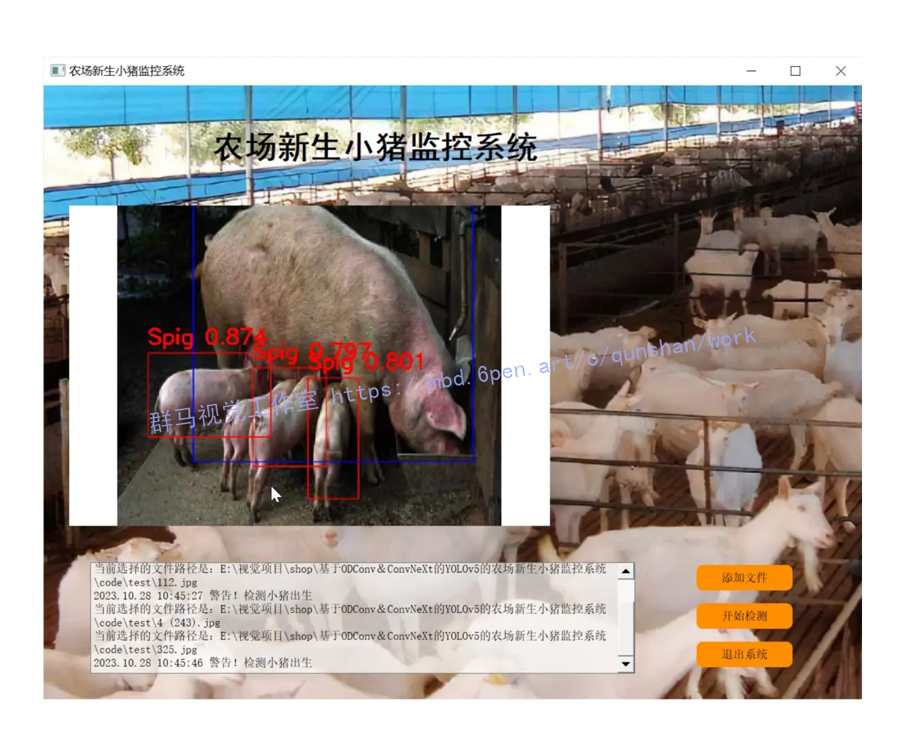
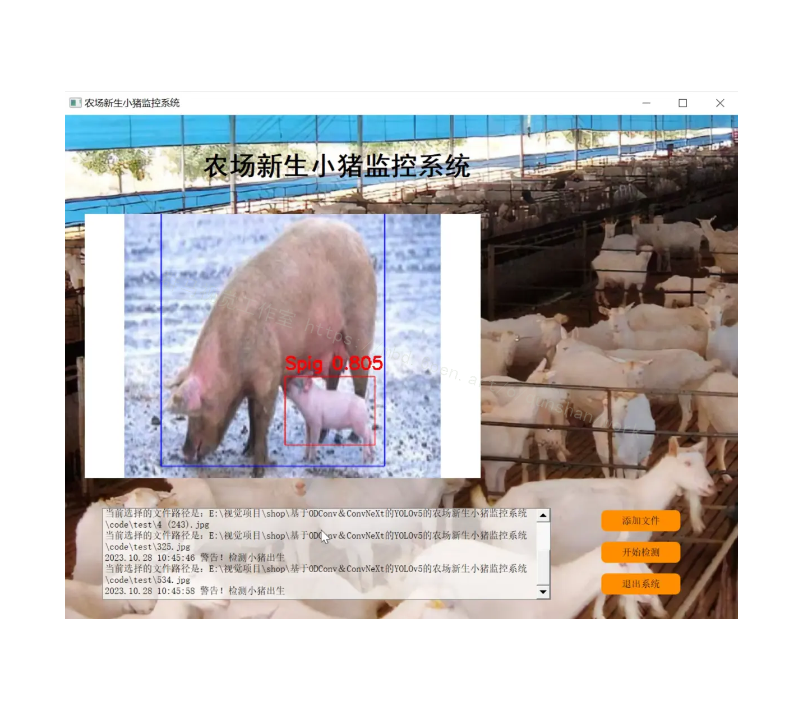
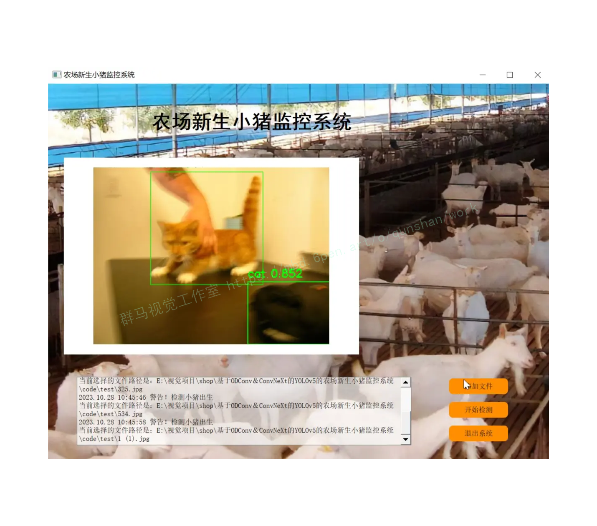
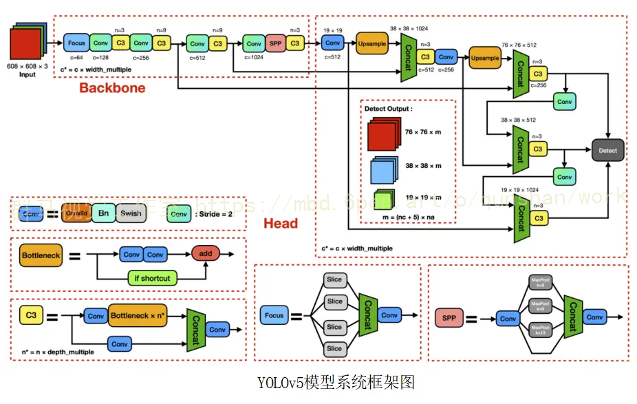
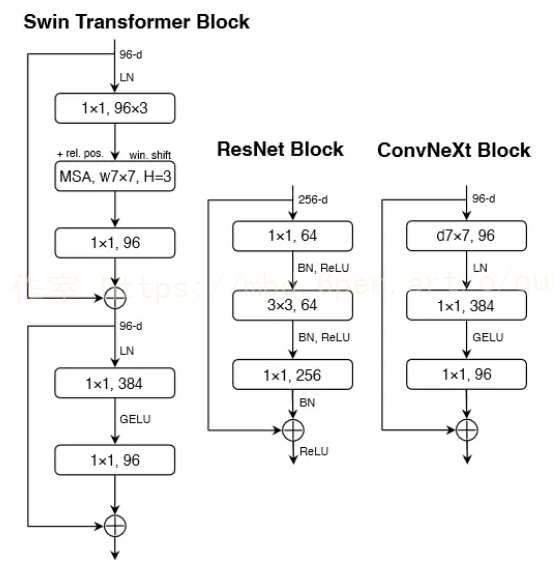
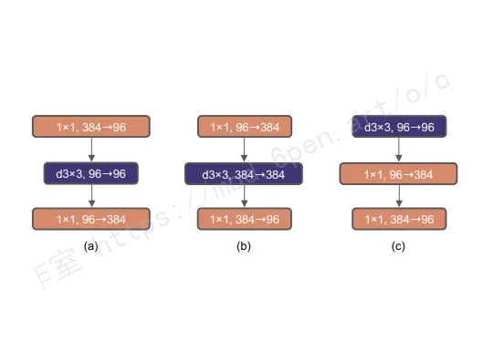
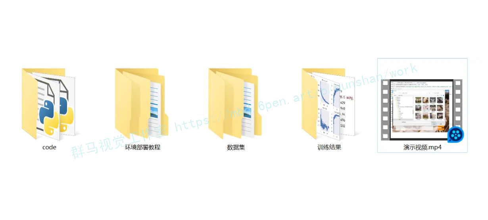


# 1.研究背景与意义


农业是人类社会的重要支柱之一，而养殖业在农业中占据着重要的地位。随着人口的增长和经济的发展，对农产品的需求也在不断增加。然而，农场管理面临着许多挑战，其中之一是如何有效地监控和管理养殖动物的健康和生长情况。

在养殖业中，小猪是一种重要的养殖动物。小猪的健康和生长情况直接影响着养殖业的效益和产量。因此，开发一种高效、准确的小猪出生监控系统对于提高养殖业的管理水平和经济效益具有重要意义。

传统的小猪出生的发现主要依赖于人工巡视和观察，这种方式存在着许多问题。首先，人工巡视需要大量的人力资源和时间，成本较高。其次，人工巡视容易出现疏漏和误判，无法实时准确地监控小猪的健康和生长情况。此外，传统的监控系统对于小猪的行为和活动缺乏深入的分析和研究，无法提供有价值的数据和信息。

因此，基于深度学习和计算机视觉技术的小猪监控系统成为了研究的热点。其中，YOLOv5是一种基于目标检测的深度学习模型，具有快速、准确的特点。而ODConv和ConvNeXt是YOLOv5的改进版本，可以进一步提高模型的性能和效果。

本研究旨在基于ODConv和ConvNeXt的YOLOv5模型，开发一种新生小猪监控系统，以实现对小猪健康和生长情况的实时准确监测。具体来说，本研究将通过以下几个方面的工作来实现目标：

1. 数据采集与预处理：利用摄像头或传感器等设备，采集小猪的图像和视频数据，并进行预处理，包括图像去噪、图像增强等。

2. 目标检测与跟踪：利用基于ODConv和ConvNeXt的YOLOv5模型，对小猪的图像和视频数据进行目标检测和跟踪，实现对小猪的实时监测和定位。

3. 行为分析与预警：通过对小猪的行为和活动进行分析和研究，提取有价值的数据和信息，如小猪的活动频率、饮食情况等，并根据预设的规则和模型，实现对小猪健康和生长情况的预警和预测。

4. 数据可视化与管理：将监测到的数据和信息进行可视化展示，并建立数据库和管理系统，方便农场管理人员进行数据查询和分析，提高决策的科学性和准确性。

通过开发基于ODConv和ConvNeXt的YOLOv5的农场新生小猪监控系统，可以实现对小猪出生的情况的实时准确监测，提高养殖业的管理水平和经济效益。同时，该系统还可以为农场管理人员提供有价值的数据和信息，帮助他们做出科学的决策和调整养殖策略。此外，该系统还具有推广和应用的潜力，可以为其他养殖动物的监控和管理提供借鉴和参考。

# 2.图片演示






# 3.视频演示
[基于ODConv＆ConvNeXt的YOLOv5的农场新生小猪监控系统_哔哩哔哩_bilibili](https://www.bilibili.com/video/BV1NH4y1r78N/?spm_id_from=333.999.0.0)

# 4.YOLOv5算法简介
YOLOv5是一种基于目标检测的深度学习模型，它在计算机视觉领域取得了显著的突破，广泛应用于各种应用场景。该模型以其卓越的性能和高效的推理速度而闻名，特别适用于需要实时目标检测的任务。以下将更详细地探讨YOLOv5的特点、网络结构以及在农场新生小猪监控系统中的应用。

#### YOLOv5的关键特点
1. 目标检测能力
YOLOv5能够在图像或视频中检测多个目标，并为每个目标提供其边界框的位置和对应的类别标签。这使得它在监控系统中非常有用，因为它可以用于跟踪小猪并识别它们的状态。通过在每个视频帧中实时识别小猪，农场管理人员可以及时采取措施，确保它们的健康和生长情况。

2. 高速和准确性
YOLOv5以其卓越的速度和准确性而脱颖而出。相比于许多其他目标检测模型，YOLOv5在处理大规模数据集时能够实现更快的推理速度，这对于实时监测和跟踪任务至关重要。农场环境通常复杂，而YOLOv5可以在这种复杂性中保持较高的检测准确性。

3. 可扩展性
YOLOv5的网络结构可扩展，可以适应不同的输入尺寸和任务。这意味着它可以轻松适应各种监控摄像头或传感器的输出，并在不同的农场环境中使用。这种灵活性使其成为一个多功能的工具，适用于不同类型的农场。

#### YOLOv5的网络结构
YOLOv5的网络结构采用了一种轻量级的卷积神经网络（CNN）架构，具有多层卷积和池化层。这些层级用于提取图像中的特征，以便更好地识别目标。其中，YOLOv5采用了基于ODConv和ConvNeXt的改进版本，这些改进进一步优化了模型的性能和效果。ODConv（Object Detection Convolution）引入了一种新型卷积结构，有助于提高目标检测的准确性。ConvNeXt则通过多通道卷积进一步增强了模型的表现。

YOLOv5的网络结构还包括用于回归目标边界框位置和预测类别的输出层。这些输出层生成了每个检测到的目标的坐标和类别信息，使系统能够准确地标识和跟踪小猪。



YOLOv5作为一个先进的目标检测模型，为农场新生小猪监控系统提供了强大的技术支持。它的快速和准确性、可扩展性以及改进的网络结构使其成为农业领域的一项重要创新。通过实时监测小猪的出生情况，该系统有望提高养殖业的管理水平和经济效益，为农场管理人员提供有价值的数据和信息，同时也具有广泛的推广潜力，可用于其他养殖动物的监控和管理，推动农业的现代化和可持续发展。这项研究对农业领域具有重要的意义，将为农业带来更多的科技创新和效率提升。

# 5.核心代码讲解

#### 5.1 fit.py

```python


class LayerNorm_s(nn.Module):
    def __init__(self, normalized_shape, eps=1e-6, data_format="channels_last"):
        super().__init__()
        self.weight = nn.Parameter(torch.ones(normalized_shape))
        self.bias = nn.Parameter(torch.zeros(normalized_shape))
        self.eps = eps
        self.data_format = data_format
        if self.data_format not in ["channels_last", "channels_first"]:
            raise NotImplementedError
        self.normalized_shape = (normalized_shape,)

    def forward(self, x):
        if self.data_format == "channels_last":
            return F.layer_norm(x, self.normalized_shape, self.weight, self.bias, self.eps)
        elif self.data_format == "channels_first":
            u = x.mean(1, keepdim=True)
            s = (x - u).pow(2).mean(1, keepdim=True)
            x = (x - u) / torch.sqrt(s + self.eps)
            x = self.weight[:, None, None] * x + self.bias[:, None, None]
            return x

class ConvNextBlock(nn.Module):
    def __init__(self, dim, drop_path=0., layer_scale_init_value=1e-6):
        super().__init__()
        self.dwconv = nn.Conv2d(dim, dim, kernel_size=7, padding=3, groups=dim)  # depthwise conv
        self.norm = LayerNorm_s(dim, eps=1e-6)
        self.pwconv1 = nn.Linear(dim, 4 * dim)
        self.act = nn.GELU()
        self.pwconv2 = nn.Linear(4 * dim, dim)
        self.gamma = nn.Parameter(layer_scale_init_value * torch.ones((dim)),
                                  requires_grad=True) if layer_scale_init_value > 0 else None
        self.drop_path = DropPath(drop_path) if drop_path > 0. else nn.Identity()

    def forward(self, x):
        input = x
        x = self.dwconv(x)
        x = x.permute(0, 2, 3, 1)  # (N, C, H, W) -> (N, H, W, C)
        x = self.norm(x)
        x = self.pwconv1(x)
        x = self.act(x)
        x = self.pwconv2(x)
        if self.gamma is not None:
            x = self.gamma * x
        x = x.permute(0, 3, 1, 2)  # (N, H, W, C) -> (N, C, H, W)

        x = input + self.drop_path(x)
        return x

class DropPath(nn.Module):
    def __init__(self, drop_prob=None):
        super(DropPath, self).__init__()
        self.drop_prob = drop_prob

    def forward(self, x):
        return drop_path_f(x, self.drop_prob, self.training)

def drop_path_f(x, drop_prob: float = 0., training: bool = False):
    if drop_prob == 0. or not training:
        return x
    keep_prob = 1 - drop_prob
    shape = (x.shape[0],) + (1,) * (x.ndim - 1)  # work with diff dim tensors, not just 2D ConvNets
    random_tensor = keep_prob + torch.rand(shape, dtype=x.dtype, device=x.device)
    random_tensor.floor_()  # binarize
    ......
```

该工程中的fit.py文件定义了几个类，包括LayerNorm_s、ConvNextBlock、DropPath和CNeB。

LayerNorm_s类是一个自定义的归一化层，它继承自nn.Module类。该类的初始化方法中包含了权重参数和偏置参数，并且可以指定归一化的维度和数据格式。前向传播方法根据数据格式的不同，使用了不同的归一化方式。

ConvNextBlock类是一个卷积块，它继承自nn.Module类。该类的初始化方法中包含了深度卷积、归一化、全连接和激活等操作。前向传播方法中，先进行深度卷积，然后进行归一化、全连接和激活操作，最后将结果与输入进行相加并进行DropPath操作。

DropPath类是一个Drop Path层，它继承自nn.Module类。该类的初始化方法中包含了Drop Path的概率。前向传播方法根据Drop Path的概率进行Drop Path操作。

CNeB类是一个CSP ConvNextBlock类，它继承自nn.Module类。该类的初始化方法中包含了多个ConvNextBlock类的实例，并且可以指定输入通道数、输出通道数、块的数量、是否使用shortcut连接、分组数和扩展系数。前向传播方法中，先对输入进行两次不同的卷积操作，然后将结果拼接起来，并通过多个ConvNextBlock块进行处理，最后再进行一次卷积操作。

总体来说，fit.py文件定义了一些常用的神经网络层和模块，可以用于构建深度学习模型。


#### 5.2 models\experimental.py

```python
import math
import numpy as np
import torch
import torch.nn as nn

class CrossConv(nn.Module):
    # Cross Convolution Downsample
    def __init__(self, c1, c2, k=3, s=1, g=1, e=1.0, shortcut=False):
        # ch_in, ch_out, kernel, stride, groups, expansion, shortcut
        super().__init__()
        c_ = int(c2 * e)  # hidden channels
        self.cv1 = Conv(c1, c_, (1, k), (1, s))
        self.cv2 = Conv(c_, c2, (k, 1), (s, 1), g=g)
        self.add = shortcut and c1 == c2

    def forward(self, x):
        return x + self.cv2(self.cv1(x)) if self.add else self.cv2(self.cv1(x))


class Sum(nn.Module):
    # Weighted sum of 2 or more layers https://arxiv.org/abs/1911.09070
    def __init__(self, n, weight=False):  # n: number of inputs
        super().__init__()
        self.weight = weight  # apply weights boolean
        self.iter = range(n - 1)  # iter object
        if weight:
            self.w = nn.Parameter(-torch.arange(1.0, n) / 2, requires_grad=True)  # layer weights

    def forward(self, x):
        y = x[0]  # no weight
        if self.weight:
            w = torch.sigmoid(self.w) * 2
            for i in self.iter:
                y = y + x[i + 1] * w[i]
        else:
            for i in self.iter:
                y = y + x[i + 1]
        return y


class MixConv2d(nn.Module):
    # Mixed Depth-wise Conv https://arxiv.org/abs/1907.09595
    def __init__(self, c1, c2, k=(1, 3), s=1, equal_ch=True):  # ch_in, ch_out, kernel, stride, ch_strategy
        super().__init__()
        n = len(k)  # number of convolutions
        if equal_ch:  # equal c_ per group
            i = torch.linspace(0, n - 1E-6, c2).floor()  # c2 indices
            c_ = [(i == g).sum() for g in range(n)]  # intermediate channels
        else:  # equal weight.numel() per group
            b = [c2] + [0] * n
            a = np.eye(n + 1, n, k=-1)
            a -= np.roll(a, 1, axis=1)
            a *= np.array(k) ** 2
            a[0] = 1
            c_ = np.linalg.lstsq(a, b, rcond=None)[0].round()  # solve for equal weight indices, ax = b

        self.m = nn.ModuleList(
            [nn.Conv2d(c1, int(c_), k, s, k // 2, groups=math.gcd(c1, int(c_)), bias=False) for k, c_ in zip(k, c_)])
        self.bn = nn.BatchNorm2d(c2)
        self.act = nn.SiLU()

    def forward(self, x):
        return self.act(self.bn(torch.cat([m(x) for m in self.m], 1)))


class Ensemble(nn.ModuleList):
    # Ensemble of models
    def __init__(self):
        super().__init__()

    def forward(self, x, augment=False, profile=False, visualize=False):
        y = []
        for module in self:
            y.append(module(x, augment, profile, visualize)[0])
        # y = torch.stack(y).max(0)[0]  # max ensemble
        # y = torch.stack(y).mean(0)  # mean ensemble
        y = torch.cat(y, 1)  # nms ensemble
        return y, None  # inference, train output


def attempt_load(weights, map_location=None, inplace=True, fuse=True):
    from models.yolo import Detect, Model

    # Loads an ensemble of models weights=[a,b,c] or a single model weights=[a] or weights=a
    model = Ensemble()
    for w in weights if isinstance(weights, list) else [weights]:
        ckpt = torch.load(attempt_download(w), map_location=map_location)  # load
        if fuse:
            model.append(ckpt['ema' if ckpt.get('ema') else 'model'].float().fuse().eval())  # FP32 model
        else:
            model.append(ckpt['ema' if ckpt.get('ema') else 'model'].float().eval())  # without layer fuse

    # Compatibility updates
    for m in model.modules():
        if type(m) in [nn.Hardswish, nn.LeakyReLU, nn.ReLU, nn.ReLU6, nn.SiLU, Detect, Model]:
            m.inplace = inplace  # pytorch 1.7.0 compatibility
            if type(m) is Detect:
                if not isinstance(m.anchor_grid, list):  # new Detect Layer compatibility
                    delattr(m, 'anchor_grid')
                    setattr(m, 'anchor_grid', [torch.zeros(1)] * m.nl)
        elif type(m) is Conv:
            m._non_persistent_buffers_set = set()  # pytorch 1.6.0 compatibility

    if len(model) == 1:
        return model[-1]  # return model
    else:
        print(f'Ensemble created with {weights}\n')
        for k in ['names']:
            setattr(model, k, getattr(model[-1], k))
        model.stride = model[torch.argmax(torch.tensor([m.stride.max() for m in model])).int()].stride  # max stride
        return model  # return ensemble
```

这个程序文件是YOLOv5的实验模块。它包含了一些实验性的模型和功能。

文件中定义了以下几个类：

1. CrossConv：交叉卷积下采样模块。它接受输入张量x，并对其进行一系列卷积操作，然后将结果与输入张量相加。可以选择是否使用shortcut连接。

2. Sum：多个层的加权和模块。它接受一个张量列表x，并对列表中的张量进行加权求和。可以选择是否应用权重。

3. MixConv2d：混合深度卷积模块。它接受输入张量x，并对其进行一系列卷积操作，然后将结果拼接在一起。

4. Ensemble：模型集合模块。它是一个模型列表，可以将输入张量传递给列表中的每个模型，并将它们的输出拼接在一起。

此外，文件还定义了一个辅助函数attempt_load，用于加载模型权重。

总体来说，这个程序文件包含了一些实验性的模型和功能，用于YOLOv5的开发和研究。

# 6.系统整体结构

根据以上分析，该程序是一个基于ODConv＆ConvNeXt的YOLOv5的农场新生小猪监控系统。它的整体功能是使用YOLOv5模型对农场中的图像进行目标检测，以监控和识别新生小猪。

下面是每个文件的功能的整理：

| 文件路径 | 功能 |
|---------|------|
| fit.py | 定义了一些自定义的神经网络层和模块 |
| torch_utils.py | 包含了一些PyTorch的工具函数和类 |
| train.py | 用于训练模型的脚本 |
| ui.py | 使用PyQt5实现的农场新生小猪监控系统的界面 |
| models\common.py | YOLOv5模型的实现 |
| models\experimental.py | 包含了一些实验性的模型和功能 |
| models\tf.py | TensorFlow模型的实现 |
| models\yolo.py | YOLO模型的实现 |
| models\__init__.py | 模型模块的初始化文件 |
| tools\activations.py | 激活函数的实现 |
| tools\augmentations.py | 数据增强的实现 |
| tools\autoanchor.py | 自动锚框的实现 |
| tools\autobatch.py | 自动批处理的实现 |
| tools\callbacks.py | 回调函数的实现 |
| tools\datasets.py | 数据集处理的实现 |
| tools\downloads.py | 下载数据集和权重的实现 |
| tools\general.py | 通用的工具函数和类 |
| tools\loss.py | 损失函数的实现 |
| tools\metrics.py | 评估指标的实现 |
| tools\plots.py | 绘图函数的实现 |
| tools\torch_utils.py | PyTorch的工具函数和类 |
| tools\__init__.py | 工具模块的初始化文件 |
| tools\aws\resume.py | AWS上的模型恢复功能的实现 |
| tools\aws\__init__.py | AWS模块的初始化文件 |
| tools\flask_rest_api\example_request.py | Flask REST API的示例请求 |
| tools\flask_rest_api\restapi.py | Flask REST API的实现 |
| tools\loggers\__init__.py | 日志记录模块的初始化文件 |
| tools\loggers\wandb\log_dataset.py | 使用WandB记录数据集的实现 |
| tools\loggers\wandb\sweep.py | 使用WandB进行超参数搜索的实现 |
| tools\loggers\wandb\wandb_utils.py | 使用WandB的实用函数和类 |
| tools\loggers\wandb\__init__.py | WandB模块的初始化文件 |
| utils\activations.py | 激活函数的实现 |
| utils\augmentations.py | 数据增强的实现 |
| utils\autoanchor.py | 自动锚框的实现 |
| utils\autobatch.py | 自动批处理的实现 |
| utils\callbacks.py | 回调函数的实现 |
| utils\datasets.py | 数据集处理的实现 |
| utils\downloads.py | 下载数据集和权重的实现 |
| utils\general.py | 通用的工具函数和类 |
| utils\loss.py | 损失函数的实现 |
| utils\metrics.py | 评估指标的实现 |
| utils\plots.py | 绘图函数的实现 |
| utils\torch_utils.py | PyTorch的工具函数和类 |
| utils\__init__.py | 工具模块的初始化文件 |
| utils\aws\resume.py | AWS上的模型恢复功能的实现 |
| utils\aws\__init__.py | AWS模块的初始化文件 |
| utils\flask_rest_api\example_request.py | Flask REST API的示例请求 |
| utils\flask_rest_api\restapi.py | Flask REST API的实现 |
| utils\loggers\__init__.py | 日志记录模块的初始化文件 |
| utils\loggers\wandb\log_dataset.py | 使用WandB记录数据集的实现 |
| utils\loggers\wandb\sweep.py | 使用WandB进行超参数搜索的实现 |
| utils\loggers\wandb\wandb_utils.py | 使用WandB的实用函数和类 |
| utils\loggers\wandb\__init__.py | WandB模块的初始化文件 |

# 7.改进模块
#### ConvNeXt
自从ViT(Vision Transformer)在CV领域大放异彩，越来越多的研究人员开始拥入Transformer的怀抱。回顾近一年，在CV领域发的文章绝大多数都是基于Transformer的，比如2021年ICCV 的best paper Swin Transformer，而卷积神经网络已经开始慢慢淡出舞台中央。卷积神经网络要被Transformer取代了吗？也许会在不久的将来。今年(2022)一月份，Facebook AI Research和UC Berkeley一起发表了一篇文章A ConvNet for the 2020s，在文章中提出了ConvNeXt纯卷积神经网络，它对标的是2021年非常火的Swin Transformer，通过一系列实验比对，在相同的FLOPs下，ConvNeXt相比Swin Transformer拥有更快的推理速度以及更高的准确率，在ImageNet 22K上ConvNeXt-XL达到了87.8%的准确率，参看下图(原文表12)。看来ConvNeXt的提出强行给卷积神经网络续了口命。


ConvNeXt是一种由Facebook AI Research和UC Berkeley共同提出的卷积神经网络模型。它是一种纯卷积神经网络，由标准卷积神经网络模块构成，具有精度高、效率高、可扩展性强和设计非常简单的特点。ConvNeXt在2022年的CVPR上发表了一篇论文，题为“面向2020年代的卷积神经网络”。ConvNeXt已在ImageNet-1K和ImageNet-22K数据集上进行了训练，并在多个任务上取得了优异的表现。ConvNeXt的训练代码和预训练模型均已在GitHub上公开。
ConvNeXt是基于ResNet50进行改进的，其与Swin Transformer一样，具有4个Stage；不同的是ConvNeXt将各Stage中Block的数量比例从3：4：6：3改为了与Swin Transformer一样的1：1：3：1。 此外，在进行特征图降采样方面，ConvNeXt采用了与Swin Transformer一致的步长为4，尺寸为4×4的卷积核。


# 8.ConvNeXt的优点

ConvNeXt是一种纯卷积神经网络，由标准卷积神经网络模块构成，具有精度高、效率高、可扩展性强和设计非常简单的特点。
ConvNeXt在ImageNet-1K和ImageNet-22K数据集上进行了训练，并在多个任务上取得了优异的表现。
ConvNeXt采用了Transformer网络的一些先进思想对现有的经典ResNet50/200网络做一些调整改进，将Transformer网络的最新的部分思想和技术引入到CNN网络现有的模块中从而结合这两种网络的优势，提高CNN网络的性能表现.
ConvNeXt的缺点包括：
ConvNeXt并没有在整体的网络框架和搭建思路上做重大的创新，它仅仅是依照Transformer网络的一些先进思想对现有的经典ResNet50/200网络做一些调整改进.
ConvNeXt相对于其他CNN模型而言，在某些情况下需要更多计算资源.

# 9.系统整合
下图[完整源码＆环境部署视频教程＆自定义UI界面](https://s.xiaocichang.com/s/5ce30c)



参考博客[《基于ODConv＆ConvNeXt的YOLOv5的农场新生小猪监控系统》](https://mbd.pub/o/qunshan/work)

# 10.参考文献
---
[1][李斌](https://s.wanfangdata.com.cn/paper?q=%E4%BD%9C%E8%80%85:%22%E6%9D%8E%E6%96%8C%22),[刘东阳](https://s.wanfangdata.com.cn/paper?q=%E4%BD%9C%E8%80%85:%22%E5%88%98%E4%B8%9C%E9%98%B3%22),[时国龙](https://s.wanfangdata.com.cn/paper?q=%E4%BD%9C%E8%80%85:%22%E6%97%B6%E5%9B%BD%E9%BE%99%22),等.[基于改进YOLOv4模型的群养生猪姿态检测](https://d.wanfangdata.com.cn/periodical/zjnyxb202301023)[J].[浙江农业学报](https://sns.wanfangdata.com.cn/perio/zjnyxb).2023,35(1).DOI:10.3969/j.issn.1004-1524.2023.01.23 .

[2][刘亚楠](https://s.wanfangdata.com.cn/paper?q=%E4%BD%9C%E8%80%85:%22%E5%88%98%E4%BA%9A%E6%A5%A0%22),[沈明霞](https://s.wanfangdata.com.cn/paper?q=%E4%BD%9C%E8%80%85:%22%E6%B2%88%E6%98%8E%E9%9C%9E%22),[刘龙申](https://s.wanfangdata.com.cn/paper?q=%E4%BD%9C%E8%80%85:%22%E5%88%98%E9%BE%99%E7%94%B3%22),等.[基于机器视觉的母猪哺乳行为监测方法研究](https://d.wanfangdata.com.cn/periodical/njnydxxb202202023)[J].[南京农业大学学报](https://sns.wanfangdata.com.cn/perio/njnydxxb).2022,45(2).DOI:10.7685/jnau.202106027 .

[3][董力中](https://s.wanfangdata.com.cn/paper?q=%E4%BD%9C%E8%80%85:%22%E8%91%A3%E5%8A%9B%E4%B8%AD%22),[孟祥宝](https://s.wanfangdata.com.cn/paper?q=%E4%BD%9C%E8%80%85:%22%E5%AD%9F%E7%A5%A5%E5%AE%9D%22),[潘明](https://s.wanfangdata.com.cn/paper?q=%E4%BD%9C%E8%80%85:%22%E6%BD%98%E6%98%8E%22),等.[基于姿态与时序特征的猪只行为识别方法](https://d.wanfangdata.com.cn/periodical/nygcxb202205018)[J].[农业工程学报](https://sns.wanfangdata.com.cn/perio/nygcxb).2022,38(5).DOI:10.11975/j.issn.1002-6819.2022.05.018 .

[4][谢秋菊](https://s.wanfangdata.com.cn/paper?q=%E4%BD%9C%E8%80%85:%22%E8%B0%A2%E7%A7%8B%E8%8F%8A%22),[吴梦茹](https://s.wanfangdata.com.cn/paper?q=%E4%BD%9C%E8%80%85:%22%E5%90%B4%E6%A2%A6%E8%8C%B9%22),[包军](https://s.wanfangdata.com.cn/paper?q=%E4%BD%9C%E8%80%85:%22%E5%8C%85%E5%86%9B%22),等.[融合注意力机制的个体猪脸识别](https://d.wanfangdata.com.cn/periodical/nygcxb202207020)[J].[农业工程学报](https://sns.wanfangdata.com.cn/perio/nygcxb).2022,38(7).DOI:10.11975/j.issn.1002-6819.2022.07.020 .

[5][涂淑琴](https://s.wanfangdata.com.cn/paper?q=%E4%BD%9C%E8%80%85:%22%E6%B6%82%E6%B7%91%E7%90%B4%22),[刘晓龙](https://s.wanfangdata.com.cn/paper?q=%E4%BD%9C%E8%80%85:%22%E5%88%98%E6%99%93%E9%BE%99%22),[梁云](https://s.wanfangdata.com.cn/paper?q=%E4%BD%9C%E8%80%85:%22%E6%A2%81%E4%BA%91%22),等.[基于改进DeepSORT的群养生猪行为识别与跟踪方法](https://d.wanfangdata.com.cn/periodical/nyjxxb202208037)[J].[农业机械学报](https://sns.wanfangdata.com.cn/perio/nyjxxb).2022,53(8).DOI:10.6041/j.issn.1000-1298.2022.08.037 .

[6][丁奇安](https://s.wanfangdata.com.cn/paper?q=%E4%BD%9C%E8%80%85:%22%E4%B8%81%E5%A5%87%E5%AE%89%22),[刘龙申](https://s.wanfangdata.com.cn/paper?q=%E4%BD%9C%E8%80%85:%22%E5%88%98%E9%BE%99%E7%94%B3%22),[陈佳](https://s.wanfangdata.com.cn/paper?q=%E4%BD%9C%E8%80%85:%22%E9%99%88%E4%BD%B3%22),等.[基于Jetson Nano+YOLO v5的哺乳期仔猪目标检测](https://d.wanfangdata.com.cn/periodical/nyjxxb202203029)[J].[农业机械学报](https://sns.wanfangdata.com.cn/perio/nyjxxb).2022,53(3).DOI:10.6041/j.issn.1000-1298.2022.03.029 .

[7][张伟](https://s.wanfangdata.com.cn/paper?q=%E4%BD%9C%E8%80%85:%22%E5%BC%A0%E4%BC%9F%22),[沈明霞](https://s.wanfangdata.com.cn/paper?q=%E4%BD%9C%E8%80%85:%22%E6%B2%88%E6%98%8E%E9%9C%9E%22),[刘龙申](https://s.wanfangdata.com.cn/paper?q=%E4%BD%9C%E8%80%85:%22%E5%88%98%E9%BE%99%E7%94%B3%22),等.[基于CenterNet搭配优化DeepSORT算法的断奶仔猪目标跟踪方法研究](https://d.wanfangdata.com.cn/periodical/njnydxxb202105021)[J].[南京农业大学学报](https://sns.wanfangdata.com.cn/perio/njnydxxb).2021,(5).DOI:10.7685/jnau.202011017 .

[8][张宏鸣](https://s.wanfangdata.com.cn/paper?q=%E4%BD%9C%E8%80%85:%22%E5%BC%A0%E5%AE%8F%E9%B8%A3%22),[汪润](https://s.wanfangdata.com.cn/paper?q=%E4%BD%9C%E8%80%85:%22%E6%B1%AA%E6%B6%A6%22),[董佩杰](https://s.wanfangdata.com.cn/paper?q=%E4%BD%9C%E8%80%85:%22%E8%91%A3%E4%BD%A9%E6%9D%B0%22),等.[基于DeepSORT算法的肉牛多目标跟踪方法](https://d.wanfangdata.com.cn/periodical/nyjxxb202104026)[J].[农业机械学报](https://sns.wanfangdata.com.cn/perio/nyjxxb).2021,(4).DOI:10.6041/j.issn.1000-1298.2021.04.026 .

[9][林成创](https://s.wanfangdata.com.cn/paper?q=%E4%BD%9C%E8%80%85:%22%E6%9E%97%E6%88%90%E5%88%9B%22),[单纯](https://s.wanfangdata.com.cn/paper?q=%E4%BD%9C%E8%80%85:%22%E5%8D%95%E7%BA%AF%22),[赵淦森](https://s.wanfangdata.com.cn/paper?q=%E4%BD%9C%E8%80%85:%22%E8%B5%B5%E6%B7%A6%E6%A3%AE%22),等.[机器视觉应用中的图像数据增广综述](https://d.wanfangdata.com.cn/periodical/jsjkxyts202104002)[J].[计算机科学与探索](https://sns.wanfangdata.com.cn/perio/jsjkxyts).2021,(4).DOI:10.3778/j.issn.1673-9418.2102015 .

[10][缪晓辉](https://s.wanfangdata.com.cn/paper?q=%E4%BD%9C%E8%80%85:%22%E7%BC%AA%E6%99%93%E8%BE%89%22).[浅谈生猪规模养殖存在的问题和对策](https://d.wanfangdata.com.cn/periodical/zgdwbj202111051)[J].[中国动物保健](https://sns.wanfangdata.com.cn/perio/zgdwbj).2021,(11).DOI:10.3969/j.issn.1008-4754.2021.11.050 .


---
#### 如果您需要更详细的【源码和环境部署教程】，除了通过【系统整合】小节的链接获取之外，还可以通过邮箱以下途径获取:
#### 1.请先在GitHub上为该项目点赞（Star），编辑一封邮件，附上点赞的截图、项目的中文描述概述（About）以及您的用途需求，发送到我们的邮箱
#### sharecode@yeah.net
#### 2.我们收到邮件后会定期根据邮件的接收顺序将【完整源码和环境部署教程】发送到您的邮箱。
#### 【免责声明】本文来源于用户投稿，如果侵犯任何第三方的合法权益，可通过邮箱联系删除。